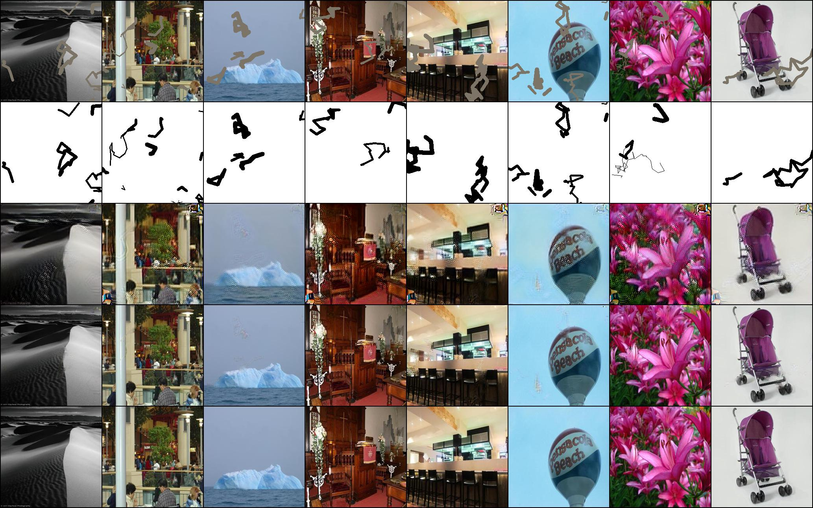

# pytorch-inpainting-with-partial-conv

**Note that this is an ongoing re-implementation and I cannot fully reproduce the results. Suggestions and PRs are welcome!**

This is an unofficial pytorch implementation of a paper, [Image Inpainting for Irregular Holes Using Partial Convolutions](https://arxiv.org/abs/1804.07723) [Liu+, arXiv2018].

## Requirements
- Python 3.6+
- Pytorch 0.4.1+

```
pip install -r requirements.txt
```

## Usage

### Preprocesse 
Generate masks by following [1] (saved under `./masks` by default).

**Note that the way of the mask generation is different from the original work**

```
python generate_data.py
```

### Train
```
CUDA_VISIBLE_DEVICES=<gpu_id> python train.py
e.g.) CUDA_VISIBLE_DEVICES=1,0 python train.py #gpu1 is parent, gpu0 is worker
```

### Fine-tune
```
CUDA_VISIBLE_DEVICES=<gpu_id> python train.py --finetune --resume <checkpoint_name>
```

## Results

Here are some results from the test set after the training of 500,000 iterations and fine-tuning (freezing BN in encoder) of 500,000 iterations.
(Top to bottom: input, mask, image generated by the network, image which is combined with the original non-masked region of image, ground truth)


Shinagawa added (2018.10.13)  
Here is an alternative result using the mask generaiton algorithm introduced by [Free-Form Image Inpainting with Gated Convolution](https://arxiv.org/abs/1806.03589) 
Hyperparameter setting: maxVertex=100, maxLength=30, maxBrushWidth=10, maxAngle=2*np.pi   
training is under going. This is 25000 iteration result with validation set.  


## TODO
- [] Check the quality

## References
- [1]: [Unofficial implementation in Chainer](https://github.com/SeitaroShinagawa/chainer-partial_convolution_image_inpainting)
